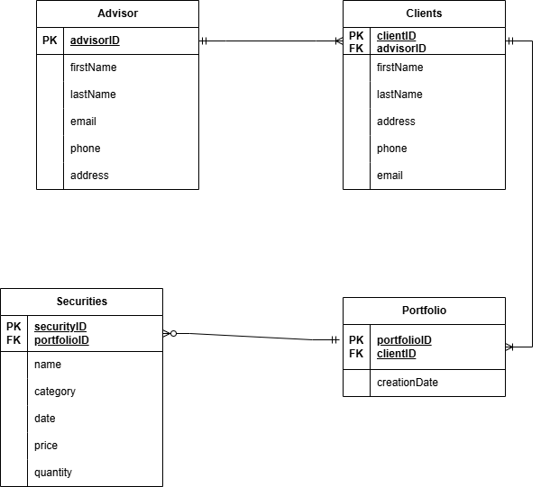

# Task 2 Starter Repo
Contains Everything you need to get started on task 2 of Forage's Wells Fargo software engineering program

## Project manager passed requirements for the new system along with the data model ticket:

* The system will help manage multiple financial advisors’ clients.
* Financial advisors must be able to create, update, and remove clients.
* Each financial advisor can have numerous clients.
* Financial advisors will be using the system during standard business hours from 9 to 5 on weekdays.
* Each client will have a portfolio.
* Client portfolios may contain zero or more securities.
* Financial advisors must be able to create, update, and remove securities from client portfolios.
* Every security has a name, a category, a purchase date, a purchase price, and a quantity.
* The system must have 99% uptime.
* The system must expose a React dashboard.
* The system’s backend must use the Spring framework for Java.
* The system must store data in a relational database.
* The system must be highly scalable.

## New system data model diagram

